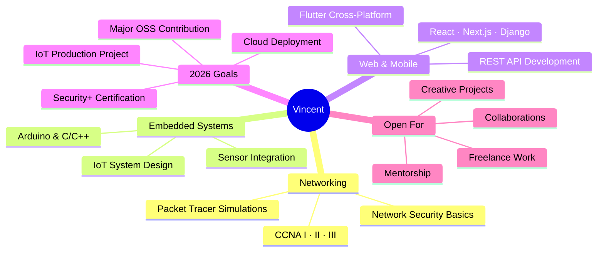

<h1 align="center">
  
</h1>

<p align="center">
  <a href="https://github.com/Vincent-HABAYIMANA?tab=followers">
    
  </a>
  &nbsp;&nbsp;
  
</p>

<br/>

<p align="center">
  
  
  
  
</p>

<br/>

---

## About Me

<table width="100%">
<tr>
<td valign="top" width="50%">

```yaml
┌──────────────────────────────────────┐
│  $ whoami                            │
├──────────────────────────────────────┤
│  name     :  Vincent HABAYIMANA      │
│  alias    :  Vincent-HABAYIMANA      │
│  location :  Kigali, Rwanda 🇷🇼       │
│  edu      :  BSc Comp Eng @ UR       │
│  network  :  CCNA I, II, III         │
│  hardware :  Arduino (C/C++)         │
│  stack    :  React · Django · Flutter│
│  email    :  vincenthabayimana1@...  │
└──────────────────────────────────────┘
```

</td>
<td valign="top" width="50%">

```bash
Currently Building
  ├── Embedded & IoT systems
  ├── Networking simulations (Packet Tracer)
  └── Full-stack web applications

Currently Learning
  ├── Advanced networking & IoT
  ├── Flutter mobile development
  └── Web security concepts 

Fun Fact
  └── I love turning ideas into real
      working systems — from circuit
      to code to cloud 
```

</td>
</tr>
</table>

---

## What I'm Exploring



---

##  GitHub Trophies

<p align="center">
  
</p>

---

##  Tech Arsenal

<div align="center">

###  Languages

<a href="https://skillicons.dev">
  
</a>

<br/><br/>

###  Frameworks & Libraries

<a href="https://skillicons.dev">
  
</a>

<br/><br/>

###  Databases

<a href="https://skillicons.dev">
  
</a>

<br/><br/>

###  Tools & Platforms

<a href="https://skillicons.dev">
  
</a>

</div>

---

##  GitHub Stats

<div align="center">
  
  
</div>

<div align="center" style="margin-top:1em">
  
</div>

---

##  Profile Analytics

<p align="center">
  
</p>
<p align="center">
  
  
  
  
</p>

---

##  2025/2026 Learning Roadmap

<table>
<tr>
<td valign="top" width="33%">

** Networking & Security**

-  CCNA I — Networking Basics
-  CCNA II — Switching & Routing
-  CCNA III — Enterprise Networking
-  Network Security Basics
-  CTF Competitions 
-  Security+ Certification

</td>
<td valign="top" width="33%">

** Embedded & IoT**

- Arduino (C/C++)
- Sensor & Module Integration
- IoT Systems Design
- Raspberry Pi / Edge Devices
- RTOS Basics
- Production IoT Project

</td>
<td valign="top" width="33%">

**Web & Mobile**

- HTML, CSS, JavaScript
- React & Next.js Basics
- Django REST APIs
- Flutter Cross-Platform Apps
- Advanced JavaScript
- Cloud Deployment (AWS/GCP)

</td>
</tr>
</table>

> Done &nbsp;|&nbsp; ⏳ In Progress &nbsp;|&nbsp; 🎯 Planned

---

## GitHub Contribution Calendar

<p align="center">
  
</p>

---

## Contribution Activity

<p align="center">
  
</p>

---

## Eating My Contributions

<p align="center">
  <picture>
    <source media="(prefers-color-scheme: dark)" srcset="https://raw.githubusercontent.com/Vincent-HABAYIMANA/Vincent-HABAYIMANA/output/github-contribution-grid-snake-dark.svg" />
    <source media="(prefers-color-scheme: light)" srcset="https://raw.githubusercontent.com/Vincent-HABAYIMANA/Vincent-HABAYIMANA/output/github-contribution-grid-snake.svg" />
    
  </picture>
</p>

> **Note:** To enable the snake animation, add a GitHub Actions workflow that generates the SVG. [See this guide](https://github.com/Platane/snk).

---

## Daily Dose of Wisdom

<p align="center">
  
</p>

---

## Random Dev Joke

<p align="center">
  
</p>

---

## 🖥️ Dev Environment

<p align="center">
  
  
  
</p>
<p align="center">
  
  
  
</p>

---

<details>
<summary>When I'm Not Coding...</summary>
<br/>

- Listening to music — R&B, Afrobeat, Lo-fi beats
- Watching tech YouTube (NetworkChuck, Fireship, Andreas Spiess for IoT)
- Tinkering with circuits and Arduino modules
- Reading about African tech innovation and startups
- Going for walks after long debugging sessions
- Coffee + next project planning session

</details>

<details>
<summary> Ask Me About...</summary>
<br/>

- Networking — CCNA topics, Packet Tracer, routing & switching
- Arduino & embedded systems — sensors, actuators, C/C++ for hardware
- Full-stack web development (React, Django, databases)
- Linux, Bash scripting, terminal productivity
- Basic cybersecurity and staying safe online
- 🇷🇼 Tech scene in Rwanda & East Africa — it's growing fast!

</details>

<details>
<summary>My Engineering Philosophy</summary>
<br/>

> *"First, solve the problem. Then, write the code."* — John Johnson

> *"Make it work, make it right, make it fast."* — Kent Beck

I believe in systems that actually work in the real world — not just on paper.
Whether it's a network topology or an Arduino-powered device, I care about
reliability, clarity, and practicality. The best solution is the one that
keeps working when no one is watching.

</details>

<details>
<summary>What I Want to Learn Next</summary>
<br/>

<p>
  
</p>

| Tech | Why |
|------|-----|
| Raspberry Pi | Edge computing & Linux embedded |
| Kubernetes | Container orchestration at scale |
| Go (Golang) | Cloud-native backend services |
| AWS | Cloud deployment & architecture |
| Redis | Caching & real-time features |
| Grafana | Network & system monitoring dashboards |

</details>

---

## Find  Me Online

<p align="center">
  <a href="https://github.com/Vincent-HABAYIMANA">
    
  </a>
  <a href="https://www.linkedin.com/in/vincent-habayimana-730b023b2">
    
  </a>
  <a href="mailto:vincenthabayimana1@gmail.com">
    
  </a>
</p>

---

<p align="center">
  
  
  
</p>

<h3 align="center">
  
</h3>


